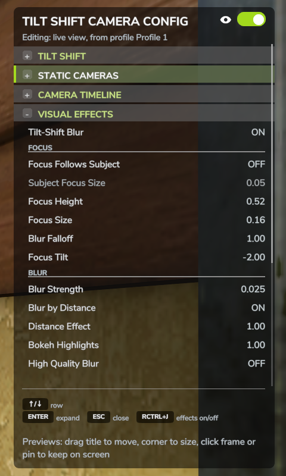

# Effekte

Jeder Effekt hat einen eigenen Abschnitt im Panel. Die Abschnitte stehen hier in der
Reihenfolge, in der das Panel sie zeigt. Zahlen in Klammern sind der Bereich der jeweiligen
Einstellung.

!!! tip
    Wähle einen Wert und drücke **Enter**, um ihn auf den Standard zurückzusetzen.

{ width="480" }

## VISUELLE EFFEKTE

Das ist der eigentliche Tilt-Shift-Effekt: ein scharfer Bereich quer über den Bildschirm,
mit Unschärfe, die darüber und darunter zunimmt. Auch die Wettereffekte werden von ihm
gezeichnet und brauchen ihn deshalb.

Tilt-Shift-Unschärfe
:   Schaltet den Tilt-Shift-Effekt ein und aus.

### SCHÄRFE

Schärfe folgt dem Ziel
:   Der scharfe Bereich folgt dem, was deine Kamera umkreist: deiner Figur, deinem Fahrzeug
    oder dem Motiv einer statischen Kamera. Zoomst du heraus, wird er schmaler, wie bei einer
    echten Miniatur aus größerer Entfernung.

Schärfebereich am Ziel (0,05 bis 2)
:   Wie groß der scharfe Bereich um das Motiv ist, wenn „Schärfe folgt dem Ziel“ an ist.

Schärfehöhe (0 bis 1)
:   Wo der scharfe Bereich auf dem Bildschirm liegt. Gilt, wenn „Schärfe folgt dem Ziel“
    aus ist.

Schärfebereich (0 bis 0,5)
:   Wie hoch der scharfe Bereich ist. Gilt, wenn „Schärfe folgt dem Ziel“ aus ist.

Unschärfeverlauf (0,5 bis 4)
:   Wie sich die Unschärfe außerhalb des scharfen Bereichs aufbaut. Niedrige Werte machen
    gleich danach unscharf; hohe Werte lassen den Bereich daneben schärfer und heben die
    Unschärfe für die Ränder auf.

Schärfeneigung (-4 bis 4)
:   Neigt die scharf abgebildete Ebene, wie ein Tilt-Shift-Objektiv. Wirkt zusammen mit
    „Unschärfe nach Entfernung“.

### UNSCHÄRFE

Unschärfestärke (0 bis 0,06)
:   Die stärkste Unschärfe, oben und unten im Bild.

Unschärfe nach Entfernung
:   Macht nach dem Abstand zur scharfen Ebene unscharf statt nach der Bildschirmposition.
    So wird ein Dach, das in den scharfen Bereich ragt, trotzdem weich, wenn es weit hinter
    deinem Motiv liegt.

Entfernungswirkung (0,5 bis 40)
:   Wie schnell die Unschärfe mit dem Abstand zur scharfen Ebene zunimmt, wenn „Unschärfe
    nach Entfernung“ an ist.

Bokeh-Lichter (0 bis 8)
:   Lässt helle Punkte zu weichen Scheiben aufblühen, wie die Lichter in einem Makrofoto.

Hochwertige Unschärfe
:   Eine weichere Unschärfe, die etwas mehr Leistung kostet.

### FARBE

Sättigung (0 bis 3), Kontrast (0,5 bis 2)
:   Farbe und Kontrast des Bilds, der spielzeughafte Pep einer Miniatur.

Vignette (0 bis 1,5)
:   Dunkelt die Bildecken ab.

## ENTFERNUNGSUNSCHÄRFE

Die Tiefenschärfe des Spiels, mit deinen Entfernungen.

Entfernungsunschärfe
:   Schaltet die Tiefenschärfe des Spiels ein und aus.

Hintergrundunschärfe (0 bis 1,5)
:   Wie stark die Ferne unscharf wird.

Hintergrund unscharf ab (5 bis 3000 m), Hintergrund voll unscharf ab (10 bis 6000 m)
:   Wo die Unschärfe im Hintergrund beginnt und wo sie ihre volle Stärke erreicht.

Vordergrundunschärfe (0 bis 1,5), Vordergrund unscharf bis (0 bis 200 m)
:   Dasselbe für den Vordergrund. Die Vordergrundunschärfe des Spiels zeigt in vielen
    Ansichten wenig oder nichts.

## FARBE

Die Farbkorrektur des Spiels, mit deinen Werten.

Farbkorrektur
:   Schaltet die Farbkorrektur ein und aus.

Sättigung (0 bis 3), Kontrast (0,5 bis 2), Mitteltöne (0,5 bis 2), Lichter (0,5 bis 2)
:   Die Korrektur selbst.

Dauerhaft anwenden
:   Das Spiel kann während des Spielens seine eigene Farbkorrektur zurücksetzen. Ist diese
    Option an, wird deine Korrektur in jedem Frame neu angewendet.

## BILD

Helligkeit (0,5 bis 2), Schärfe (0 bis 3)
:   Helligkeit und Nachschärfen des Spiels.

## KAMERA UND OBJEKTIV

Kameradistanz (aus oder 1 bis 200 m)
:   Lässt die Orbit-Kamera viel weiter zurückfahren, als das Spiel erlaubt, für den
    klassischen Miniaturblick von hoch oben. Gilt für die Third-Person-Ansicht zu Fuß und
    für die Außenkamera eines Fahrzeugs; Kabinenkameras behalten ihre eigene Distanz.

Eigenes Sichtfeld, Sichtfeld (10 bis 110 Grad)
:   Ersetzt das Sichtfeld der Kamera. Ein enges Sichtfeld macht die Szene flacher, wie ein
    Teleobjektiv.

Objektiv seitlich verschieben, Objektiv hoch/runter verschieben (-0,5 bis 0,5)
:   Verschiebt das Bild seitlich oder nach oben und unten, ohne die Kamera zu drehen, wie der
    Shift eines Tilt-Shift-Objektivs.

Flache Ansicht, Größe der flachen Ansicht (5 bis 400 m)
:   Eine Ansicht ganz ohne Perspektive, wie ein Architekturmodell. Die Größe gibt an, wie
    viele Meter der Welt von oben bis unten auf den Bildschirm passen.

## WETTER

Regen, Schnee und Hagel, in die Miniatur gezeichnet, damit sie mit ihr unscharf werden. Der
Regen des Spiels ist nicht Teil des Bilds, mit dem der Effekt arbeitet, deshalb zeichnet die
Mod ihren eigenen.

Wettereffekte
:   Schaltet Regen, Schnee und Hagel der Mod ein und aus.

Wie das Spielwetter
:   Folgt dem echten Wetter: In der Miniatur regnet es, wenn es im Spiel regnet,
    einschließlich des Übergangs von einem Wetter zum nächsten. Schalte es aus, um die Mengen
    selbst einzustellen.

Regen, Schnee, Hagel (0 bis 2)
:   Wie viel davon fällt, wenn „Wie das Spielwetter“ aus ist.

Wind (-2 bis 2)
:   Wie weit der Wind den Niederschlag seitlich treibt. Negative Werte treiben ihn in die
    andere Richtung.

Fallgeschwindigkeit (0,1 bis 4)
:   Wie schnell er fällt. 1 entspricht dem Regen des Spiels.

Mit der Szene verwischen (0 bis 4)
:   Wie stark der Niederschlag mit Unschärfe und Bokeh verschmilzt.

## STOP-MOTION

Stop-Motion
:   Begrenzt die Bildrate für einen Stop-Motion-Look.

Bilder pro Sekunde
:   8, 10, 12, 15, 24 oder 30 Bilder pro Sekunde.
