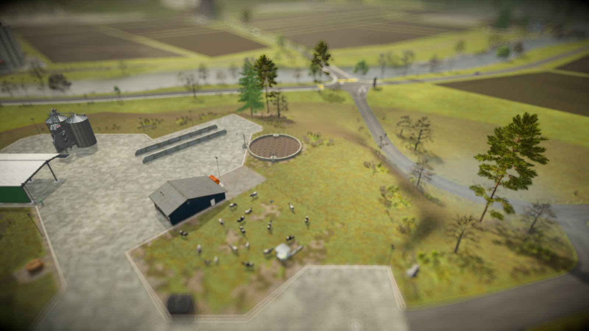

# Prise en main

Caméra Tilt Shift donne à Farming Simulator 25 l'allure d'un réseau de train miniature. Le
mod ajoute un effet tilt-shift aux vues à la troisième personne : une bande nette en travers
de l'écran, qui suit ce que votre caméra regarde, avec au-dessus et en dessous un flou qui
augmente avec la profondeur. Les points lumineux deviennent des disques de bokeh, et un
étalonnage donne à la scène les couleurs vives, un peu jouet, d'une maquette peinte. Tout se
règle pendant que vous jouez.

Le panneau propose aussi des réglages d'objectif (champ de vision, vue à plat sans
perspective, décentrement, caméra plus éloignée) ainsi que le flou de distance et
l'étalonnage du jeu lui-même. Une limite d'images donne un rendu stop motion, et le mod
peut dessiner pluie, neige et grêle, qui se floutent avec le reste de l'image et suivent la
météo du jeu. Les rendus qui vous plaisent s'enregistrent en profils, chacun sur son propre
raccourci.

Trois extras optionnels restent désactivés tant que vous ne les activez pas :
des [caméras fixes](static-cameras.md) à placer autour de la ferme, des
[fenêtres d'aperçu](preview-windows.md) qui montrent ces caméras en direct, et une
[timeline caméra](timeline.md) qui passe de l'une à l'autre toute seule. La timeline a été
pensée pour filmer en timelapse vos ouvriers aux champs.

## Démarrage rapide

1. Installez le mod. Copiez `FS25_TiltShift.zip` dans votre dossier de mods
   (`Documents/My Games/FarmingSimulator2025/mods`) ou téléchargez-le depuis le ModHub dans
   le jeu, puis activez-le pour votre partie.
2. Passez à une vue à la troisième personne. L'effet ne s'applique qu'aux caméras orbitales :
   à pied en troisième personne, ou la caméra extérieure d'un véhicule.
3. Appuyez sur **Ctrl droit + J** pour activer les effets. Ils sont désactivés à chaque
   chargement d'une partie, mais vos réglages sont conservés.
4. Appuyez sur **Ctrl droit + K** pour ouvrir le panneau. [Le panneau](panel.md) explique
   comment s'y déplacer, [Rendus et profils](looks-and-profiles.md) présente les rendus
   prêts à l'emploi et l'enregistrement des vôtres, et [Effets](effects.md) détaille chaque
   réglage.

!!! tip "Où l'effet s'applique"
    Les vues cabine, la première personne et les caméras fixes des véhicules ne sont pas
    modifiées. Les caméras libres et cinématiques d'autres mods ont aussi l'effet, car il
    suit la caméra active, quelle qu'elle soit. La boutique, l'atelier, le mode construction
    et l'écran de sommeil affichent toujours le jeu sans effet.

## Extras

Les caméras fixes, les fenêtres d'aperçu et la timeline caméra restent désactivées tant que
vous ne les activez pas dans les lignes EXTRAS de la section TILT-SHIFT du panneau. Chacune
dépend de la précédente, donc son interrupteur n'apparaît qu'une fois la précédente activée :

1. **Caméras fixes**
2. **Fenêtres d'aperçu**, une fois les caméras fixes activées
3. **Timeline caméra**, une fois les fenêtres d'aperçu activées

## Multijoueur

Le mod fonctionne en multijoueur. Il ne modifie que votre propre écran, et chaque joueur a
ses propres caméras et sa propre timeline.
