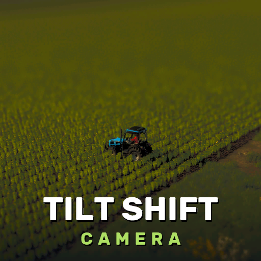

---
hide:
  - navigation
  - toc
---

{ .ts-logo }

# Tilt Shift Camera

Tilt Shift Camera adds a tilt-shift effect to the third-person views. A band across the screen stays sharp and everything above and below it is blurred, which makes the scene look like a miniature model. By default the sharp band follows whatever your camera orbits. You can also add bokeh on bright points, stronger colours and a vignette, change the field of view, remove perspective, shift the lens, zoom the camera out further, and limit the frame rate for a stop-motion look. The mod can draw its own rain, snow and hail, which follow the game's weather and blur with the rest of the picture. Save the looks you like as profiles.

[Getting started](getting-started.md){ .md-button .md-button--primary }
[:material-bug-outline: Report an issue](https://github.com/robinduckett/fs25-tiltshift/issues/new/choose){ .md-button }

{ .ts-shot }

## What it does

The effect only applies to third-person cameras. Cab views, first person and fixed vehicle cameras are not affected. It also works with free and cinematic cameras from other mods, because it follows whichever camera is active.

All settings are in one panel (Right Ctrl + K), which you can use with the keyboard, a gamepad or the mouse. Click a section to fold or unfold it and a row to select it. Change a value with the arrow keys, by clicking the &lt; and &gt; next to it, or by dragging it sideways. After you click a row, the mouse wheel changes its value. The switch in the panel's title turns all effects on and off. UI Scale (0.75x, 1x or 1.25x) changes the size of the panel and all the mod's windows.

## Extras

Three extras are off until you switch them on, one after the other, in the EXTRAS rows of the panel.

### Static cameras

Right Ctrl + N adds a camera at your current view, fixed in place in the world. Right Ctrl + C switches to it and back, and Right Ctrl + V switches to the next camera, while you keep driving or walking. Each camera has its own effect settings or uses one of your profiles. You can aim a camera in the panel, or fly it into place with the mouse and W A S D. Cameras are saved with your savegame, and in multiplayer each player has their own. Every camera is also shown on the pause menu map and on the minimap, where you can select it to switch to it or delete it.

[More](static-cameras.md)

### Preview windows

A live view from each camera, shown next to the panel. You can move a window by its title bar, resize it from its corner, pin it so that it stays on screen when the panel is closed, hide it, fly its camera to a new position, or delete the camera (after a confirmation). The camera you are editing has a green frame, and the camera on air has a red one.

[More](preview-windows.md)

### Camera timeline

An editor window that switches between your cameras automatically, for example to record a timelapse of your workers in the field. Drag cameras from the palette onto the track, drag shots to change their order and their edges to change their length, zoom with the mouse wheel, and preview the result in the monitor. Start Timeline (or Right Ctrl + T) hides the panel, all windows and the HUD, counts down from 3 and then plays the timeline on the main view, either in a loop or once, staying on the last camera at the end. Press Esc to go back. The timeline is saved with your cameras.

[More](timeline.md)

## Hotkeys

| Key | What it does |
| --- | --- |
| **Right Ctrl + K** | Open or close the panel |
| **Right Ctrl + J** | Turn all effects on or off (your settings are kept, whether saved or not) |
| **Right Ctrl + 1-9** | Apply profile 1-9 and turn the effects on; press the same number again to turn them off |
| **Right Ctrl + N** | Add a static camera at your current view |
| **Right Ctrl + C** | Switch to a static camera, or back to the live view |
| **Right Ctrl + V** | Switch to the next static camera |
| **Right Ctrl + T** | Start the camera timeline; press Right Ctrl + T or Esc to stop |
| **Flying a camera** | W A S D move it, the mouse turns it, Shift moves faster, Enter saves, Esc cancels |
| **Arrow keys or number pad** | Select rows in the panel; Left and Right change the value (Page Up and Page Down for big steps) |
| **Enter** | Fold or unfold a section, or run the selected row; Esc: close the panel |
| **Gamepad** | The d-pad selects rows and changes values while the panel is open |

!!! note "Known limitations"

    - Rain, snow and hail are simulated, because of limits in the game engine. I have made them as close to the game's weather as I can.
    - Some decals, glass and other transparent materials are not visible while the effects are on. The effects work on a copy of the picture that the game makes before it draws transparent materials.
    - Preview windows show each camera's view without the effects. The tilt-shift blur and the weather are only shown in the main view.
    - While you look through a static camera, the game switches you from first person to third person on foot so that your character is visible, and the game's own camera key (C) does nothing until you go back to the live view.
