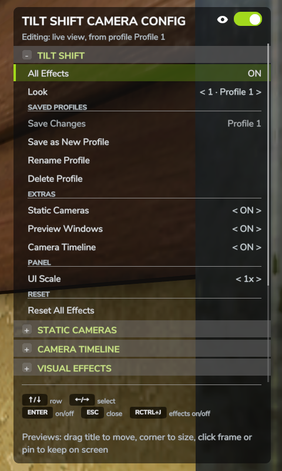

# Rendus et profils

Un **rendu** est un ensemble complet de réglages d'effets : le flou tilt-shift, les
couleurs, l'objectif, la météo, tout ce que contiennent les sections d'effets du panneau.
Le mod fournit quelques **rendus prédéfinis**, et vous enregistrez les vôtres comme
**profils**.

{ width="480" }

## Rendus prédéfinis

Robin 3e personne
:   Le rendu tilt-shift réglé : flou tilt-shift avec « Netteté suit le sujet », flou selon
    la distance et bokeh. Tous les autres effets sont d'abord désactivés.

Miniature
:   Flou de distance sur l'arrière-plan et un étalonnage prononcé.

Miniature + stop motion
:   Miniature à 15 images par seconde.

Subtil
:   Un flou de distance et un étalonnage plus doux.

Tout désactiver
:   Désactive chaque effet, comme **Réinitialiser tous les effets**.

Miniature, Miniature + stop motion et Subtil laissent le flou tilt-shift et la météo tels
quels. Vous ne pouvez pas modifier un rendu prédéfini lui-même, mais vous pouvez enregistrer
ce qu'il vous donne comme profil personnel.

## Choisir un rendu

La ligne **Rendu** en haut de la section TILT-SHIFT montre le rendu à l'écran. Elle liste
d'abord les rendus prédéfinis, puis vos profils enregistrés.

- **Gauche / Droite** (ou `<` et `>` à côté de la valeur) parcourent la liste. Parcourir ne
  change encore rien à l'écran.
- **Entrée**, ou un clic sur la ligne, applique le rendu sur lequel vous êtes. Appliquer un
  rendu active aussi les effets.
- Si vous passez à une autre ligne sans appliquer, la ligne Rendu montre de nouveau le rendu
  à l'écran.

Un profil enregistré doté d'un raccourci affiche son numéro devant son nom, par exemple
**2 · Moisson**.

Quand vous modifiez un réglage, la ligne Rendu ajoute **(modifié)**, par exemple
**2 · Moisson (modifié)**, et les valeurs modifiées passent en vert. Si vous appliquez un
autre rendu alors qu'il reste des modifications non enregistrées, le jeu demande d'abord :
**Abandonner les modifications non enregistrées et appliquer … ?** Choisissez **Appliquer**
pour continuer ou **Annuler** pour garder vos modifications.

La ligne Rendu affiche **Personnalisé** quand ce qui est à l'écran n'est aucun des rendus de
la liste, par exemple après la suppression du profil dont il venait.

## Enregistrer votre propre rendu

Les lignes **PROFILS ENREGISTRÉS** sous la ligne Rendu agissent sur le profil enregistré
qui est à l'écran. Les lignes qui ne peuvent rien faire pour l'instant sont grisées.

Enregistrer les modifications
:   Enregistre vos modifications dans le profil à l'écran. Son nom s'affiche à droite de la
    ligne. Disponible seulement quand un profil enregistré est à l'écran et a des
    modifications.

Enregistrer comme nouveau profil
:   Enregistre tout de suite ce qui est à l'écran comme nouveau profil, nommé **Profil 1**,
    **Profil 2** et ainsi de suite. Le nouveau profil devient le rendu à l'écran.

Renommer le profil
:   Ouvre la zone de texte du jeu pour donner au profil à l'écran un nouveau nom de 32
    caractères au plus. Les caractères qu'un nom de fichier ne peut pas contenir
    (`\ / : * ? " < > |`) sont retirés, et un nom déjà pris par un autre profil est refusé.

Supprimer le profil
:   Supprime le profil à l'écran après confirmation. Ce que vous voyez reste à l'écran, en
    **Personnalisé**.

Pour modifier un profil qui n'est pas à l'écran, appliquez-le d'abord dans la ligne Rendu.

Lors d'une nouvelle installation, le mod enregistre le rendu par défaut sous
**Profile 1**, sur le raccourci 1.

## Raccourcis clavier

**Ctrl droit + 1** à **Ctrl droit + 9** appliquent vos profils enregistrés tout de suite,
sans confirmation, et activent les effets. Le même chiffre à nouveau désactive les effets.

Chaque profil garde son numéro pour de bon : un nouveau profil prend le plus petit numéro
libre, supprimer un profil libère son numéro, et le renommer le conserve. Au-delà de neuf
profils, les suivants n'ont pas de raccourci mais restent dans la ligne Rendu.

## La ligne sous le titre

La ligne sous le titre du panneau indique ce que modifient les lignes d'effets et d'où vient
le rendu :

| La ligne indique | Signification |
| --- | --- |
| Modification : vue en direct | Votre propre vue, sans profil enregistré ni rendu prédéfini derrière |
| Modification : vue en direct, profil Moisson | Votre propre vue, avec un profil enregistré |
| Modification : vue en direct, rendu prédéfini Miniature | Votre propre vue, avec un rendu prédéfini |
| Modification : Caméra 1, son propre rendu | Une caméra fixe avec son propre rendu |
| Modification : Caméra 1, utilise le profil Moisson | Une caméra fixe qui utilise un profil enregistré |

## Caméras fixes et profils

La ligne **Rendu** d'une [caméra fixe](static-cameras.md) indique si elle a son propre
rendu (**Propres**) ou si elle utilise l'un de vos profils enregistrés.

- **Propres :** les modifications faites en regardant à travers la caméra restent avec la
  caméra. Elles ne comptent jamais comme des modifications non enregistrées.
- **Un profil :** regarder à travers la caméra applique le profil. Les modifications faites
  à ce moment-là s'affichent en **(modifié)** ; **Enregistrer les modifications** les écrit
  dans le profil, et chaque caméra qui l'utilise en profite. Les modifications non
  enregistrées sont perdues quand vous changez de vue.
- Appliquer un autre profil enregistré en regardant à travers une caméra qui utilise un
  profil fait passer la caméra à ce profil. Sur une caméra avec son propre rendu, les
  réglages du profil sont plutôt copiés dans son propre rendu.
- Appliquer un rendu prédéfini en regardant à travers une caméra donne ce rendu à la caméra
  comme rendu propre.
- Renommer un profil le renomme pour chaque caméra qui l'utilise.
- Supprimer un profil laisse son rendu aux caméras qui l'utilisaient, comme rendu propre.

## Après un redémarrage

Le mod retient quel rendu était à l'écran. Si vous avez modifié un profil enregistré sans
enregistrer, il affiche toujours **(modifié)** la prochaine fois que vous jouez.
