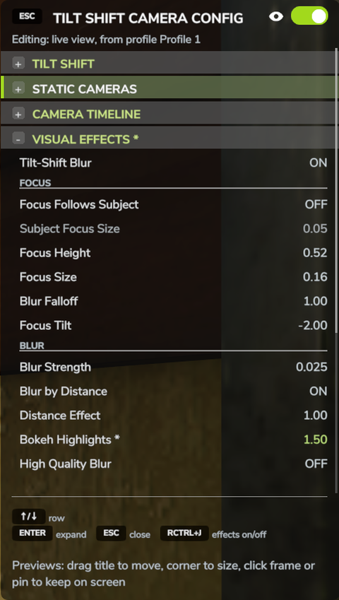

# Le panneau

Tous les réglages du mod se trouvent dans un panneau sur la droite de l'écran. Appuyez sur
**Ctrl droit + K** pour l'ouvrir, et sur **Ctrl droit + K** ou **Échap** pour le fermer.
Le jeu continue de tourner quand le panneau est ouvert, mais vos touches commandent alors
le panneau au lieu de votre personnage ou de votre véhicule. Le jeu est assombri derrière le
panneau tant qu'il est ouvert. Quand vous fermez le panneau, vous retrouvez la vue depuis
laquelle vous l'avez ouvert, même si vous avez regardé à travers une caméra fixe
entre-temps. Si vous avez des modifications non enregistrées d'un profil, le panneau vous
demande avant de se fermer si vous voulez les enregistrer.

## Disposition

La barre de titre indique CONFIGURATION TILT-SHIFT. Le bouton Échap à son extrémité gauche
ferme le panneau. L'interrupteur à son extrémité droite, à côté de l'icône en forme d'œil,
active et désactive tous les effets, comme **Ctrl droit + J**.

La ligne sous le titre indique à quoi s'appliquent actuellement les réglages des effets :
à votre propre vue ou à une caméra fixe, et de quel profil enregistré ou rendu prédéfini
ils proviennent.

Les réglages sont regroupés en sections, par exemple TILT-SHIFT, EFFETS VISUELS et MÉTÉO,
que vous pouvez plier et déplier. À la première ouverture, seule la première section est
dépliée ; ensuite, le panneau mémorise les sections que vous avez laissées ouvertes. La
légende en bas indique les touches utilisables sur la ligne sélectionnée.

Les valeurs que vous avez modifiées depuis la dernière application d'un rendu ou le dernier
enregistrement d'un profil s'affichent en vert, avec un astérisque après le nom de la ligne.
L'en-tête d'une section contenant une valeur modifiée porte aussi l'astérisque : une section
repliée montre ainsi que quelque chose a changé à l'intérieur.

{ width="480" }

{ width="480" }

## Clavier et manette

| Touche | Action |
| --- | --- |
| Flèches **haut / bas** | Sélectionner la ligne au-dessus ou en dessous |
| Flèches **gauche / droite** | Modifier la valeur ou l'option sélectionnée |
| **Page préc. / Page suiv.** | Modifier la valeur par grands pas |
| **Entrée** ou **Espace** | Plier ou déplier une section, exécuter une action, basculer un interrupteur ou rétablir la valeur par défaut |
| **Échap** | Fermer le panneau |

Vous pouvez aussi utiliser le pavé numérique : 8 et 2 changent de ligne, 4 et 6 modifient
la valeur, 7 et 9 la modifient par grands pas, et 5 fonctionne comme Entrée.

À la manette, la croix directionnelle sélectionne les lignes et modifie les valeurs. Le
bouton de validation fonctionne comme Entrée, et le bouton retour ferme le panneau.

## Souris

Cliquez sur le titre d'une section pour la plier ou la déplier, et sur une ligne pour la
sélectionner. Un clic sur un interrupteur ou une action l'exécute immédiatement.

Pour modifier une valeur, cliquez sur `<` ou `>` à côté, ou faites-la glisser sur le côté.
Maintenez **Maj** en cliquant pour modifier par grands pas.

La molette fait défiler la liste. Pour modifier une valeur avec la molette, cliquez d'abord
sur sa ligne : une barre verte apparaît à gauche de la ligne, et la molette modifie alors
cette valeur. Cliquez de nouveau sur la ligne pour que la molette fasse à nouveau défiler la
liste.

Vous pouvez aussi cliquer sur les touches Échap et Ctrl droit + J affichées dans la
légende. En dehors du panneau, la molette règle le zoom de votre caméra comme d'habitude.

## La section TILT-SHIFT

La première section contient les réglages que vous utiliserez le plus souvent.

Tous les effets
:   Active ou désactive tous les effets, comme **Ctrl droit + J**. Vos réglages sont
    conservés, qu'ils soient enregistrés ou non.

Rendu
:   Choisissez un rendu prédéfini ou l'un de vos profils enregistrés. Voir
    [Rendus et profils](looks-and-profiles.md).

PROFILS ENREGISTRÉS
:   Enregistrer les modifications, Enregistrer comme nouveau profil, Renommer le profil et
    Supprimer le profil. Voir
    [Rendus et profils](looks-and-profiles.md#enregistrer-votre-propre-rendu).

EXTRAS
:   Caméras fixes, Fenêtres d'aperçu et Timeline caméra. Chaque ligne n'apparaît qu'une
    fois la précédente activée. Voir [Caméras fixes](static-cameras.md),
    [Fenêtres d'aperçu](preview-windows.md) et [Timeline caméra](timeline.md).

Échelle de l'interface
:   0,75x, 1x ou 1,25x. Modifie la taille du panneau et de toutes les fenêtres du mod.
    À 1x, le panneau a la même taille que le HUD du jeu.

Réinitialiser tous les effets
:   Désactive tous les effets et rétablit l'aspect normal du jeu : le flou tilt-shift, le
    flou de distance, le stop motion, le champ de vision personnalisé, la vue à plat, le
    décentrement, l'étalonnage, la luminosité, la netteté et la distance de la caméra. Vos
    profils enregistrés ne sont pas modifiés.
