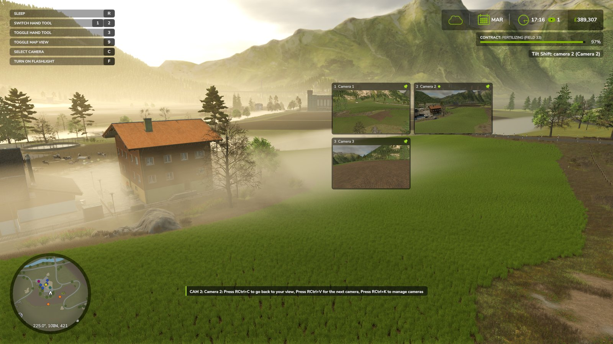
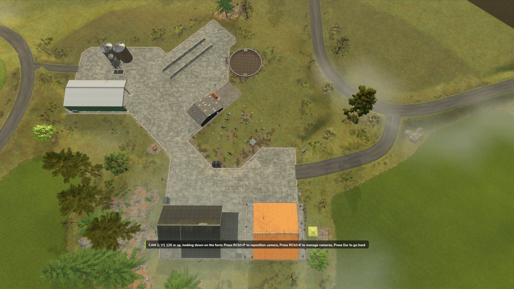

# Statische Kameras

Eine statische Kamera steht an einem festen Punkt in der Welt. Du kannst mehrere aufstellen,
zum Beispiel rund um ein Feld, und zwischen ihnen wechseln, während du weiterspielst. Das
Spiel wird nicht angehalten, wenn du durch eine statische Kamera schaust.

!!! info "Zuerst einschalten"
    Öffne das Panel (**Rechts-Strg + K**) und stelle **Statische Kameras** in den
    EXTRAS-Zeilen auf AN. Danach erscheint im Panel der Abschnitt STATISCHE KAMERAS.

{ width="480" }

## Hinzufügen und wechseln

| Taste | Funktion |
| --- | --- |
| **Rechts-Strg + N** | Kamera an deiner aktuellen Ansicht hinzufügen |
| **Rechts-Strg + C** | Zur zuletzt benutzten statischen Kamera wechseln oder zurück zur Live-Ansicht |
| **Rechts-Strg + V** | Zur nächsten statischen Kamera wechseln |

Neue Kameras heißen Kamera 1, Kamera 2 und so weiter. Wenn du die Kamera wechselst, zeigt
eine Meldung oben auf dem Bildschirm, durch welche Kamera du gerade schaust.

Solange du durch eine statische Kamera schaust:

- zeigt eine Leiste unten am Bildschirm die Tasten: **Rechts-Strg + C** zurück zu deiner
  Ansicht, **Rechts-Strg + V** zur nächsten Kamera, **Rechts-Strg + K**, um Kameras zu
  verwalten. Sie gehört zum HUD des Spiels und verschwindet, sobald das HUD ausgeblendet ist
  (das Spiel selbst hat dafür keine Taste; siehe [Filmen](getting-started.md#filmen));
- schaltet die Mod dich zu Fuß in die dritte Person, damit deine Spielfigur zu sehen ist,
  und zurück in die Ego-Perspektive, wenn du zur Live-Ansicht zurückkehrst;
- hat die Kamerataste des Spiels (**C**) keine Wirkung, bis du zur Live-Ansicht
  zurückkehrst, damit sie dich nicht versehentlich von der statischen Kamera wegschaltet;
- ändert sich die Ansicht nicht, wenn du in ein Fahrzeug ein- oder aussteigst;
- übernehmen Menüs, der Schlafbildschirm und filmische Kamera-Mods den Bildschirm wie
  gewohnt.

## Der Abschnitt STATISCHE KAMERAS

Wenn du das Panel schließt, kehrt der Bildschirm zu der Ansicht zurück, von der aus du es
geöffnet hast. Mit der Zeile Ansicht, mit Kamera bearbeiten und beim Fliegen einer Kamera
schaust du durch eine Kamera, solange das Panel offen ist. Willst du weiterspielen und dabei
durch eine Kamera schauen, schließe das Panel und nimm **Rechts-Strg + C** oder
**Rechts-Strg + V**.

Ansicht
:   Was auf dem Bildschirm zu sehen ist, solange das Panel offen ist: **Live** (deine eigene
    Ansicht) oder eine deiner Kameras. Mit Links und Rechts wechselst du.

Kamera hier hinzufügen
:   Fügt eine Kamera an deiner aktuellen Ansicht hinzu, wie **Rechts-Strg + N**.

Kamera bearbeiten
:   Wählt die Kamera, die die Zeilen darunter ändern. Die Überschrift über der Zeile zeigt
    den Namen dieser Kamera. Drücke **Enter**, um durch sie zu schauen.

Look
:   **Eigene**, dann hat die Kamera ihre eigenen Effekteinstellungen, oder eines deiner
    gespeicherten Profile. Eine neue Kamera startet mit einer Kopie der Einstellungen, die
    du beim Hinzufügen hattest. Bei **Eigene** wird jede Änderung, die du beim Blick durch
    die Kamera machst, mit ihr gespeichert. Wie sich Kameras mit Profil verhalten, steht
    unter [Looks und Profile](looks-and-profiles.md#statische-kameras-und-profile).

Zu meiner Ansicht verschieben
:   Verschiebt die Kamera an deine aktuelle Ansicht. Ihre Effekteinstellungen bleiben
    gleich.

Vorschaufenster
:   Zeigt das [Vorschaufenster](preview-windows.md) dieser Kamera oder blendet es aus.

In Position fliegen
:   Damit fliegst du die Kamera selbst an eine neue Position. Siehe unten.

POSITION UND AUSRICHTUNG
:   Legt Position und Blickrichtung der Kamera genau fest. Position X, Höhe und Position Z
    verschieben sie in Schritten von 0,25 m, mit Bild auf und Bild ab in Schritten von
    2 m. Drehen, Neigen und Rollen drehen sie in Schritten von 1 Grad, mit Bild auf und
    Bild ab in Schritten von 10 Grad. Das Sichtfeld lässt sich von 5 bis 150 Grad
    einstellen.

Kamera löschen
:   Löscht die Kamera, nachdem du im Ja/Nein-Dialog des Spiels bestätigt hast.

## Eine Kamera in Position fliegen

Wähle im Panel **In Position fliegen** oder klicke auf die Flug-Schaltfläche im
Vorschaufenster der Kamera. Das Panel schließt sich, und du schaust durch die Kamera. Mit
deinen Bewegungstasten (**W A S D**) bewegst du die Kamera, mit der Maus drehst du sie.
Halte **Umschalt** gedrückt, um schneller zu fliegen. Mit **Enter** speicherst du die neue
Position, mit **Esc** brichst du ab: Die Kamera kehrt an ihren alten Platz zurück, und der
Bildschirm zeigt wieder die Ansicht, die du vor dem Fliegen hattest.

Danach öffnet sich das Panel wieder: Nach **Enter** schaust du durch die Kamera an ihrer
neuen Position. Schließt du das Panel, kehrst du zu der Ansicht zurück, von der aus du es
geöffnet hast.

## Auf der Karte

Jede statische Kamera ist auf der Minikarte und auf der Karte im Pausenmenü markiert.
Wählst du eine Kamera auf der Karte im Pausenmenü aus, erscheinen zwei weitere Optionen:
**Zur Kamera wechseln**, um durch sie zu schauen, und **Kamera löschen**, um sie zu löschen
(nach einer Rückfrage).

Nach **Zur Kamera wechseln** schließt sich das Menü und du schaust durch die Kamera. Das HUD
ist ausgeblendet, und eine Leiste unten am Bildschirm zeigt drei Tasten:

| Taste | Was sie bewirkt |
| --- | --- |
| **Rechts-Strg + P** | Die Kamera in Position fliegen (siehe oben). Danach schaust du wieder von der Karte aus durch sie |
| **Rechts-Strg + K** | Das Panel öffnen, um deine Kameras zu verwalten. Schließt du es, kehrst du zu deiner Ansicht vor der Karte zurück |
| **Esc** | Zurück zu deiner Ansicht vor der Karte |

## Speichern

Kameras gehören zu dem Spielstand, in dem du sie angelegt hast, und werden geschrieben, wenn
du das Spiel speicherst. Die Mod bewahrt ihre Kameras in ihrem eigenen Einstellungsordner
auf
(`Dokumente/My Games/FarmingSimulator2025/modSettings/FS25_TiltShift`), nicht im Ordner des
Spielstands; mit einem kopierten Spielstand wandern sie also nicht mit. Im Mehrspielermodus
hat jeder Spieler seine eigenen Kameras.

Stellst du **Statische Kameras** im Panel auf AUS, werden die Kameras und alles, was dazu
gehört, ausgeblendet, und du kehrst zur Live-Ansicht zurück. Deine Kameras werden dabei
nicht gelöscht: Sie sind wieder da, sobald du Statische Kameras einschaltest.
