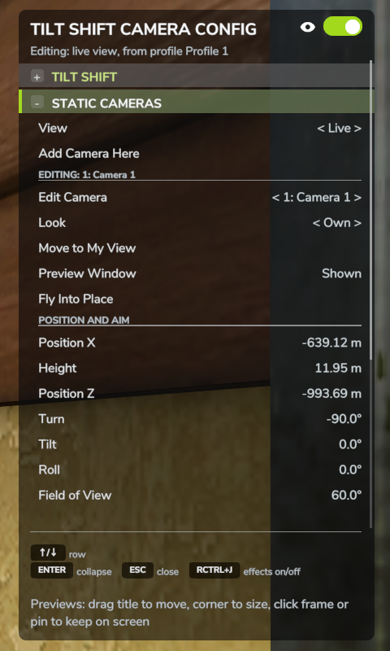
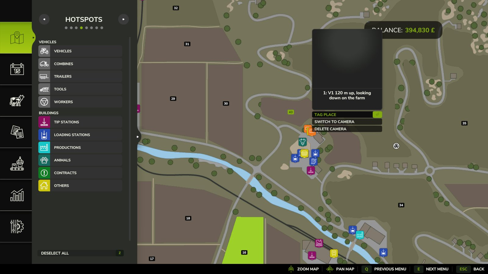

# Static cameras

A static camera works like a tripod left standing in the world. Put a few around a field
and switch between them while you carry on playing; the game doesn't pause while a static
camera is on screen.

!!! info "Switch them on first"
    Open the panel (**Right Ctrl + K**) and set **Static Cameras** in the EXTRAS rows to ON.
    The STATIC CAMERAS section then appears in the panel.

{ width="480" }

## Adding and switching

| Key | What it does |
| --- | --- |
| **Right Ctrl + N** | Place a camera exactly where your view is now |
| **Right Ctrl + C** | Switch to your last static camera, or back to the live view |
| **Right Ctrl + V** | Go to the next static camera |

New cameras are named Camera 1, Camera 2 and so on. When you switch, a message at the top
of the screen says which camera you are looking through.

While a static camera is on screen:

- On foot, the game puts you in third person so that you are visible in the shot.
- The mod takes over the game's own camera key (**C**) until you go back to the live view,
  so pressing it doesn't pull you out of the shot.
- Getting into or out of a vehicle doesn't change the view.
- Menus, the sleep screen and cinematic camera mods still take over the screen as usual.

## The STATIC CAMERAS section

View
:   What is on screen: **Live** or one of your cameras. Left and right switch between them.

Add Camera Here
:   The same as **Right Ctrl + N**.

Edit Camera
:   Picks the camera that the rows below it change, and the heading above it names that
    camera. Press **Enter** to look through it.

Look
:   Either **Own**, the camera's own tilt-shift settings, or one of your saved profiles. A
    new camera starts with a copy of the look you had when you placed it. With **Own**,
    anything you change while looking through the camera is stored with it. See
    [Looks and profiles](looks-and-profiles.md#static-cameras-and-profiles) for cameras that
    use a profile.

Move to My View
:   Moves the camera to where your own view is now. Its look stays the same.

Preview Window
:   Shows or hides this camera's [preview window](preview-windows.md).

Fly Into Place
:   Lets you fly the camera into position yourself, as described below.

POSITION AND AIM
:   Set the camera's position and direction by numbers. Position X, Height and Position Z
    move it in steps of 0.25 m, or 2 m with Page Up and Page Down. Turn, Tilt and Roll
    rotate it in steps of 1 degree, or 10 degrees with Page Up and Page Down. Field of View
    goes from 5 to 150 degrees.

Delete Camera
:   Deletes the camera once you confirm in the game's Yes/No dialog.

## Flying a camera into place

Choose **Fly Into Place** in the panel, or click the fly button on the camera's preview
window. The panel closes and you look through the camera. Your movement keys (**W A S D**)
move it and the mouse turns it; hold **Shift** to move faster. **Enter** saves the new
position, and **Esc** cancels and puts the camera back where it was.

Afterwards the panel opens again, and you are still looking through the camera.

## On the map

Each static camera has a marker on the pause-screen map and on the minimap. Select a marker
on the big map to get two extra actions: **Switch to Camera** looks through it, and
**Delete Camera** deletes it after the same Yes/No question.

## Saving

Cameras belong to the savegame and are written when you save the game. In multiplayer,
each player has their own cameras.

Turning **Static Cameras** off in the panel hides everything to do with cameras and takes
you back to the live view. Your cameras aren't deleted; they come back when you switch it
on again.
