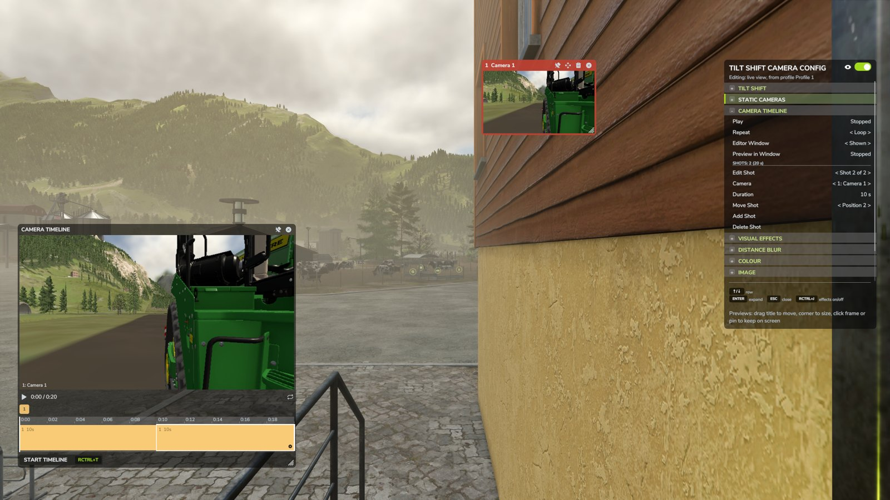

# Kamera-Zeitleiste

Die Kamera-Zeitleiste schneidet von selbst zwischen deinen statischen Kameras. Stelle eine
Liste von Einstellungen zusammen, jede eine Kamera für eine Anzahl Sekunden, starte sie und
lass deine Helfer die Feldarbeit machen, während die Ansichten von allein wechseln: bereit
für eine Zeitraffer-Aufnahme.

!!! info "Zuerst einschalten"
    Die Zeitleiste braucht [statische Kameras](static-cameras.md) und
    [Vorschaufenster](preview-windows.md). Sind beide an, stelle **Kamera-Zeitleiste** in den
    EXTRAS-Zeilen des Panels auf AN. Danach erscheinen der Abschnitt KAMERA-ZEITLEISTE und das
    Editor-Fenster.

## Das Editor-Fenster

Das Fenster KAMERA-ZEITLEISTE öffnet sich neben dem Panel. Von oben nach unten:

Der Monitor
:   Ein Bild der Kamera am Abspielkopf. Ein Klick darauf startet oder pausiert den Schnitt
    im Monitor.

Transportleiste
:   Die **Abspielen**-Taste spielt den Schnitt nur im Monitor ab: Die Hauptansicht bleibt,
    wo sie ist. Daneben steht die Zeit. Die **Wiederholen**-Taste rechts wechselt zwischen
    **Schleife** und **Einmal** (das Wiederholen-Symbol mit einem Verbotszeichen).

Kamerapalette
:   Ein Chip pro Kamera. **Klick** auf einen Chip fügt am Ende eine Einstellung dieser
    Kamera hinzu, **Ziehen** auf die Spur fügt sie dort ein, wo du sie loslässt.

Lineal und Spur
:   Ein Block pro Einstellung, gefärbt nach Kamera.

    - **Klick** auf einen Block wählt ihn; der Abspielkopf springt an seinen Anfang.
    - **Einen Block ziehen**, um ihn früher oder später zu legen.
    - **Seine rechte Kante ziehen**, um seine Dauer in ganzen Sekunden zu ändern.
    - Sein **×** löscht ihn.
    - **Klick** auf das Lineal oder einen leeren Teil der Spur setzt den Abspielkopf.
      **Ziehen** über das Lineal spult durch den Schnitt; Ziehen auf einem leeren Teil der
      Spur scrollt.
    - Das **Mausrad** zoomt um den Mauszeiger herum. Ist hineingezoomt, erscheint unter der
      Spur eine Bildlaufleiste. Du kannst über das Ende der letzten Einstellung hinaus zoomen
      und scrollen.

Zeitleiste starten
:   Spielt die Zeitleiste wirklich ab, in der Hauptansicht. Die Tastenkombination
    **Rechts-Strg + T** steht daneben.

Wie ein Vorschaufenster lässt sich der Editor an seiner Titelleiste verschieben und am Griff
unten rechts in der Größe ändern. Die **Nadel** lässt ihn bei geschlossenem Panel sichtbar,
das **×** blendet ihn aus (die Zeile **Editor-Fenster** im Panel zeigt ihn wieder). Während
der Monitor läuft, bekommt das Vorschaufenster der Kamera im Monitor einen roten Rahmen.

## Der Abschnitt KAMERA-ZEITLEISTE

Alles, was das Fenster kann, geht auch im Panel, mit Tastatur oder Gamepad.

Abspielen
:   Zeigt, wo die Zeitleiste steht (Gestoppt oder die Einstellung und die verbleibenden
    Sekunden). **Enter** oder ein Klick startet sie, wie „Zeitleiste starten“.

Wiederholen
:   **Schleife** oder **Einmal**.

Editor-Fenster
:   **Sichtbar** oder **Ausgeblendet**.

Vorschau im Fenster
:   Startet oder stoppt den Schnitt im Monitor des Fensters.

Einstellung bearbeiten
:   Wählt die Einstellung, die die Zeilen darunter ändern. Die Überschrift darüber zählt
    deine Einstellungen und ihre Gesamtlänge. Mit **Enter** schaust du durch die Kamera der
    Einstellung.

Kamera
:   Die Kamera, die diese Einstellung zeigt.

Dauer
:   Wie lange die Einstellung dauert, von 1 Sekunde bis zu einer Stunde, in Schritten von
    1 Sekunde (10 Sekunden mit Bild-auf und Bild-ab).

Einstellung verschieben
:   Legt die Einstellung früher (Links) oder später (Rechts).

Einstellung hinzufügen
:   Fügt nach der gewählten Einstellung eine neue hinzu, genauso lang und mit der nächsten
    Kamera. Mehrmals gedrückt geht sie so alle deine Kameras durch.

Einstellung löschen
:   Löscht die gewählte Einstellung.

## Die Zeitleiste starten

Drücke **Zeitleiste starten**, wähle die Zeile **Abspielen** oder drücke **Rechts-Strg + T**:

1. Das Panel schließt sich, und alle Fenster werden ausgeblendet, auch angeheftete, ebenso
   das HUD des Spiels.
2. „Zeitleiste startet in 3..“ zählt von 3 herunter, über „Esc drücken, um zurückzukehren“.
3. Die Meldungen verschwinden, und die Zeitleiste läuft in der Hauptansicht und wechselt die
   Kameras ohne Meldungen auf dem Bildschirm.

Mit **Schleife** läuft sie, bis du sie stoppst. Mit **Einmal** spielt sie jede Einstellung
und bleibt dann auf der letzten Kamera stehen.

Drücke **Esc** oder **Rechts-Strg + T**, um zurückzukehren: Du kommst zu deiner vorherigen
Ansicht zurück, das HUD erscheint wieder, und das Panel öffnet sich, falls es offen war.

Die Uhr der Zeitleiste steht still, solange das Spiel pausiert ist oder du schläfst, damit
keine Einstellung abläuft, während nichts passiert.

## Speichern

Die Zeitleiste wird mit deinen Kameras in deinem Spielstand gespeichert. Löschst du eine
Kamera, verschwinden auch ihre Einstellungen.
